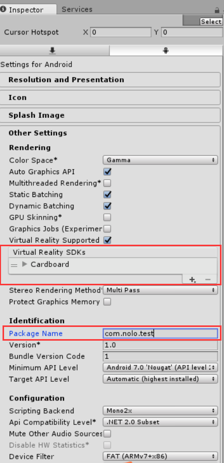

# Nolo Unity

Nolo Unity SDK 1.0 
Nolo Android Server 1.0.3 
Unity 2017.4 

The Nolo kit:
<ul>
	<li>The head tracking marker contains the "brain" of the Nolo kit, and needs to be connected to the host device over USB.</li>
	<li>The controllers pair wirelessly with the head marker.</li>
	<li>The base station works like a Vive Lighthouse--it only requires power; there's no data connection.</li>
</ul>

More notes: 
<ul>
	<li>Although Nolo has Windows drivers (and can even be made to work with SteamVR), it's mainly intended for use with Android.</li>
	<li>For Android development, you don't have to install any of the Windows apps mentioned in the docs.</li>
	<li>You also don't want to install the Nolo Home Android app mentioned in the docs. That's an app store, and if you install it all your Android builds will require a cert to communicate with the Nolo base station.</li> 
	<li>Instead, install the DRM-free Android server app included here.</li>
	<li>Although the docs say 4.4 KitKat is the recommended Android SDK, the examples use 7.0 Nougat.</li>
</ul>

