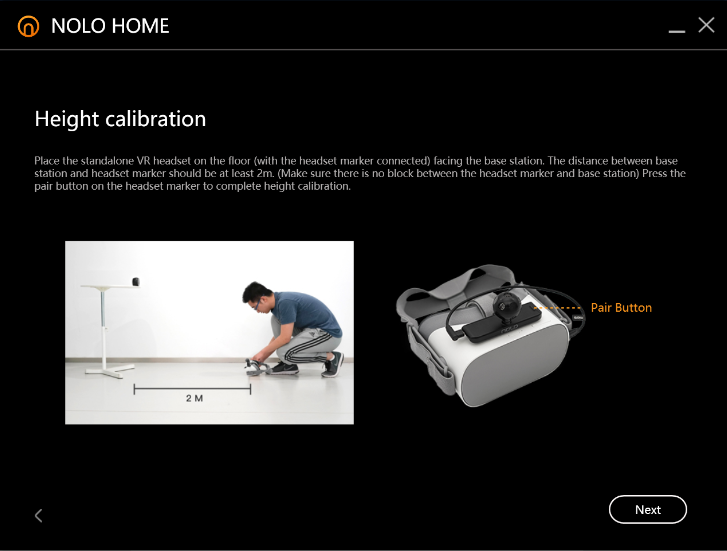

# Nolo Unity

Nolo Unity SDK 1.0 
Nolo Android Server 1.0.3 
Unity 2017.4 

### The Nolo kit:
<ol>
<li>The <b>head tracker</b>, meant to be mounted on a headset, contains the "brain" of the Nolo kit. It needs a wired USB connection to the <b>host device</b>, a phone or PC.</li>

<li>The head tracker and the two <b>controllers</b> receive signals from the <b>base station</b>.</li>
	
<li>The base station can be placed on any flat surface facing the user. It has a 4m range, but only in its line of sight. Like Vive Lighthouses, it does not need to be connected to the host device.</li>

<li>Without the base station, the host device will receive rotation and button presses from the trackers, but not position.</li>
</ol>

### Setup: 
http://forums.nolovr.com/discussion/493/pairing-issue-cant-pair-my-controllers 
<ol>
<li>Turn on the base station by pressing the power button (on top). The power button should light up red.</li>

<li>Hold down the base station's pair button (in back) until the power button flashes green.</li>

<li>Turn on the controllers by pressing and releasing the power button (below the LED light). The LED should light up red.</li>

<li>One at a time, hold down each controller's pair button (smallest button the left side) until the controller vibrates and turns off.</li>

<li>Turn the controllers on again and their lights should be green.

<li>Connect the main tracking marker to a phone or PC over USB. Its power light should turn red.</li>

<li>Hold down the tracking marker's pair button (left top side) until its light continously blinks green.</li>

<li>Finally, hold down the base station's pair button again. The tracking marker's light should turn steady green.</li>
</ol>

### Calibrating: 
<ol>
<li>Place the base station about 2m away, elevated off the floor, with no obstructions in between. A table edge works well.</li>

<li>Place the tracking marker (usually mounted on a headset) on the floor with the Nolo logo facing the base station.</li>

<li>Press the power button on the tracking marker until it lights up green.</li>
</ol>
https://www.nolovr.com/OCGO

### Firmware update: 
https://www.reddit.com/r/NoloVR/comments/6nebl3/controllers_positional_tracking_are_reversed/dkyf2nc/ 
If the axes of controller movement seem to be flipped and recalibrating doesn't help, old firmware may be to blame. A firmware updater app is in the tools folder; use at your own risk. 

### Notes: 
<ul>
<li>Although Nolo has Windows drivers (and can even be made to work with SteamVR), it's mainly intended for use with Android.</li>

<li>For Android development, you don't have to install any of the Windows apps mentioned in the docs.</li>

<li>You also don't want to install the Nolo Home Android app mentioned in the docs. That's an app store, and if you install it all your Android builds will ask for a cert you don't have.</li> 

<li>Instead, install the DRM-free Android dev server apk in the tools folder.</li>

<li>Although the docs say 4.4 KitKat is the recommended Android SDK, the examples use 7.0 Nougat.</li>
</ul>

